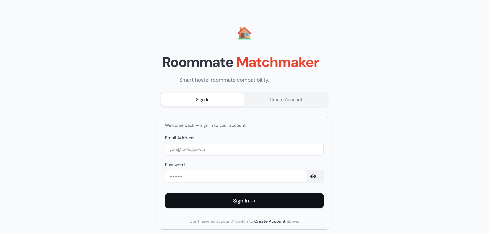
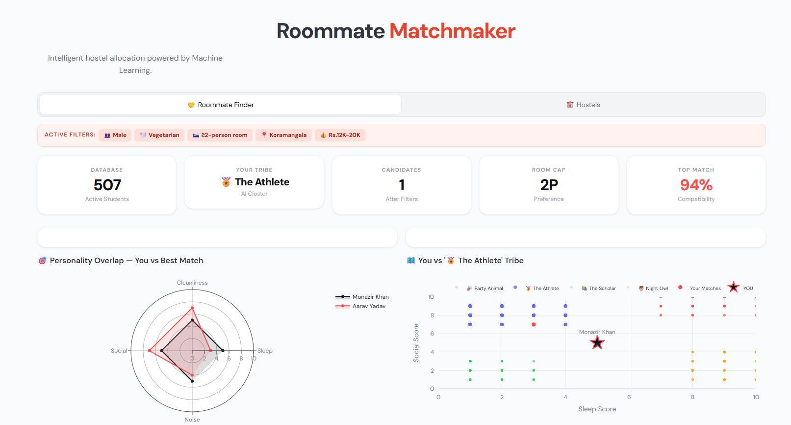
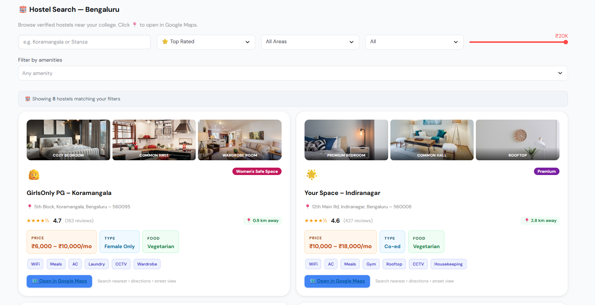

# 🏠 Roommate Matchmaker

An AI-powered roommate matching web application that helps students find compatible roommates based on their lifestyle, habits, and personal preferences. The system analyzes user data using Machine Learning techniques and recommends the best roommate based on compatibility scores.

---

## 🚀 Features

- 🔐 User Registration and Login
- 👤 Student Profile Management
- 📝 Lifestyle Preference Collection
- 🤖 AI-Based Roommate Recommendation
- 📊 Compatibility Score Prediction
- 📈 Interactive Dashboard
- 🎯 Personality Tribe Classification
- 🔍 Advanced Filtering
- 📱 Responsive Design

---

## 📖 Project Overview

Roommate Matchmaker is designed to simplify hostel and shared accommodation allocation by recommending compatible roommates instead of assigning them randomly.

The application collects user preferences such as sleeping schedule, cleanliness, food preference, noise tolerance, social behavior, preferred location, room capacity, and budget. It then applies Machine Learning algorithms to identify users with similar lifestyles and recommends the best roommate.

---

## 🧠 Machine Learning Workflow

```text
User Registration
        │
        ▼
Preference Collection
        │
        ▼
Data Preprocessing
        │
        ▼
Feature Extraction
        │
        ▼
K-Means Clustering
        │
        ▼
Cosine Similarity
        │
        ▼
Compatibility Score
        │
        ▼
Best Roommate Recommendation
```

---

## 🛠️ Technologies Used

### Frontend

- HTML5
- CSS3
- JavaScript
- Bootstrap

### Backend

- Python
- Flask

### Machine Learning

- Scikit-learn
- Pandas
- NumPy
- NLTK

### Data Storage

- CSV
- JSON

### Data Visualization

- Plotly
- Matplotlib

---

## 📊 Dataset Features

The recommendation system considers:

- Sleep Schedule
- Cleanliness
- Social Battery
- Noise Tolerance
- Food Preference
- Gender Preference
- Room Capacity
- Preferred Area
- Monthly Budget
- Personality Traits

---

## 📂 Project Structure

```text
Roommate-Matchmaker/
│
├── app.py
├── requirements.txt
├── static/
├── templates/
├── dataset/
├── screenshots/
│   ├── login.png
│   ├── dashboard-overview.png
│   └── dashboard-results.png
├── README.md
└── .gitignore
```

---

## ⚙️ Installation

Clone the repository

```bash
git clone https://github.com/yourusername/Roommate-Matchmaker.git
```

Navigate to the project directory

```bash
cd Roommate-Matchmaker
```

Create a virtual environment

```bash
python -m venv venv
```

Activate the virtual environment

### Windows

```bash
venv\Scripts\activate
```

### Linux / macOS

```bash
source venv/bin/activate
```

Install dependencies

```bash
pip install -r requirements.txt
```

Run the application

```bash
python app.py
```

Open your browser

```text
http://127.0.0.1:5000
```

---

# 📸 Application Screenshots

## 🔐 Login Page



---

## 📊 Dashboard Overview



---

## 🤝 Roommate Recommendation Dashboard



---

## 🎯 Machine Learning Model

The recommendation engine combines the following techniques:

- K-Means Clustering
- Cosine Similarity
- Feature Engineering
- Data Preprocessing

These methods group students with similar lifestyles and calculate compatibility scores to recommend the most suitable roommate.

---

## 🚀 Future Enhancements

- Real-time Chat System
- Notification Feature
- Mobile Application
- MongoDB Integration
- Firebase Authentication
- AI Personality Detection
- Deep Learning Recommendation Engine
- Admin Dashboard
- Email Verification
- Room Booking System

---

## 💡 Applications

- College Hostels
- University Accommodation
- Paying Guest (PG) Services
- Shared Apartments
- Student Housing Platforms

---

## 👨‍💻 Author

**Monazir Khan**

Master of Computer Applications (MCA)

---

## ⭐ Support

If you found this project useful, please consider giving this repository a ⭐ on GitHub.

---


